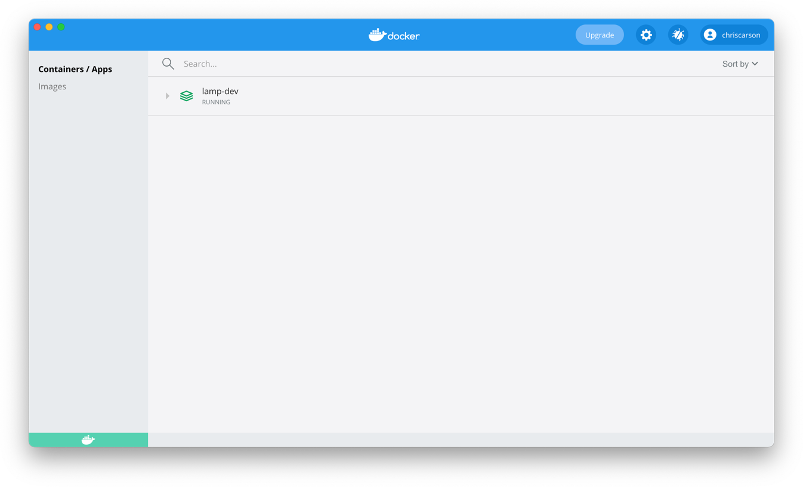
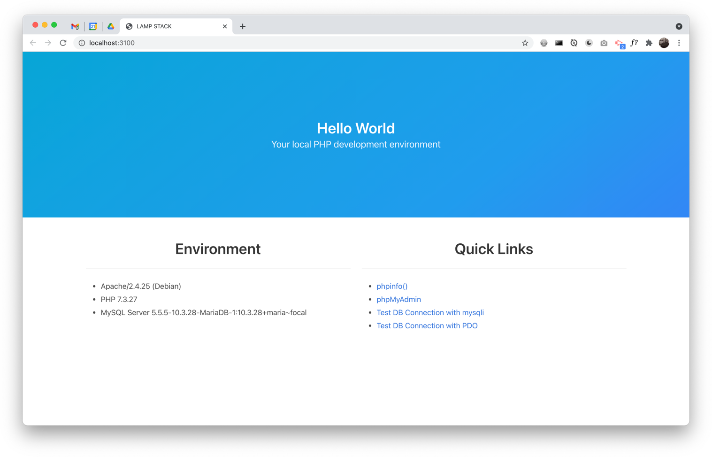
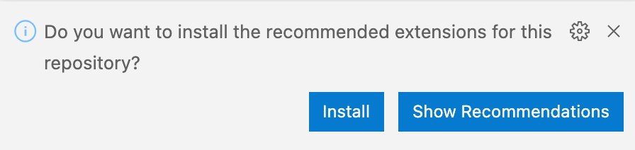
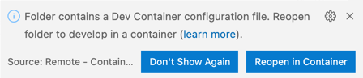
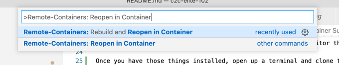

# Docker LAMP Stack with VS Code Remote Container Support

A basic LAMP stack environment built using Docker Compose, intended to be used with VS Code Remote Containers.

This stack is for **educational and development purposes only**  -- it's not intended as is for production deployments. 

Based on https://github.com/sprintcube/docker-compose-lamp.


## What's LAMP?
LAMP stands for **L**inux **A**pache **M**ySQL **P**HP. 
- Linux is an operating system, like Mac or Windows, that deals with talking to the hardware, making it do useful things, like adding 2 + 2, or rendering a picture of a kitten on a screen. 
- Apache is a web server that accepts requests from other computers on the network (read, the Internet,) and decides how to respond, either by serving back the resource itself (`/kitten.jpg -> kitten.jpg`) or passing off the logic to another program (`/random-kitten` -> `random-kitten.php`.)
- MySQL is a relational database. It allows us to store and look up data about our kittens.
- PHP is language in which we both write the logic of our application and write out the HTML that will be returned to the browser. 

## What's Docker?
Docker is a program that installs and runs the "containers" for our local dev environment: PHP, Apache, MySQL and so on. Each container is a "virtual" machine running Linux. Whats the point? Rather than each developer installing PHP, Apache, MySQL, etc. running on their own local machine, everybody shares a stable, reproducible version of these things across operating systems and machines.

## What's VS Code?
VS Code is the Integrated Development Environment (IDE) that we'll use for editing code.

## What Are VS Code Remote Containers?
Remote Containers provide a way for multiple developers to share the same VS Code environment -- Intellisense, debugging, etc. 


## Containers in this stack

- PHP + Apache + NodeJS (for js/css asset building)
- MySQL 
- phpMyAdmin (an admin app for looking at what's in your MySQL database)
- Redis 

##  Getting Started
 
### 1. Prerequisites

You should know how to open a Terminal on your OS. 

You should make sure you have the following installed:
 - git: https://git-scm.com/book/en/v2/Getting-Started-Installing-Git This will allow us to push and pull from GitHub.
- Docker Desktop: https://www.docker.com/products/docker-desktop 
- VS Code: https://code.visualstudio.com/ This is the code editor the we'll be using.


### 2. Clone this repo and build the containers (Terminal)
Once you have those things installed, open up a terminal...
```bash
# Clone this repo...
git clone git@github.com:cdcarson/lamp-docker-vscode.git

# Change into the directory...
cd lamp-docker-vscode

# Copy `sample.env` to `.env`...
cp sample.env .env

# Build the containers...
docker-compose up -d

# You'll see a whole bunch of stuff going on here.
# It may take some time to complete. Sit back and relax.
```

The first time you run `docker-compose up` it may take a significant amount of time (like 5 or 10 minutes) to complete. Docker is downloading and compiling a whole bunch of source code. Don't worry -- the next time it'll only take a few seconds. You should see something like this at the end:

```bash
Creating lamp-dev-database ... done
Creating lamp-dev-redis    ... done
Creating lamp-dev-php73      ... done
Creating lamp-dev-phpmyadmin ... done
```

Make sure everything's good. Open up Docker Desktop. You should see the `lamp-dev` app running:



Go to http://localhost:3100/. You should see a "Hello World" web page:



You can click on the links on the page to make sure everything is working.

**Important before going on to the next step:** Shut everything down. In the terminal:
```bash
docker-compose stop
```


### 2. Start VS Code and open the project as a dev container

Start VS Code. Open the `lamp-docker-vscode` folder.  `File -> Open Workspace...`.

If you do not already have the "Remote - Containers" VS Code extension installed, you'll be prompted to install it:



Go ahead and click "Install." (If you don't see this prompt, you can always install the  "Remote - Containers" extension from `View -> Extensions`.)

You will then be prompted to reopen the workspace in a dev container:



Click "Reopen in Container." If you don't see this prompt, you can always open in via the [Command Palette](https://code.visualstudio.com/docs/getstarted/userinterface#_command-palette). Select "Reopen in Container":



If you've followed the steps above (i.e. running `docker-compose up` from the command line) it should only take a few seconds for the containers to boot. If not, it may take a few minutes to download and compile the source code.


